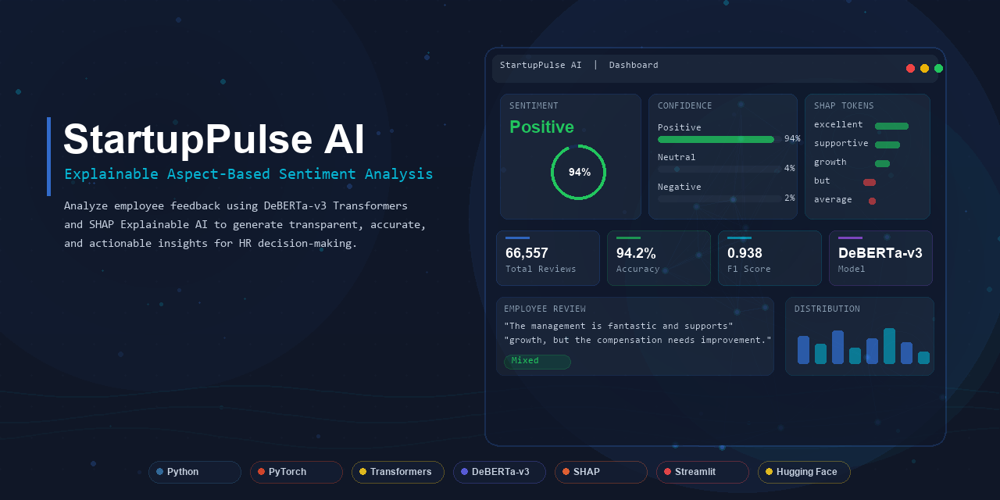
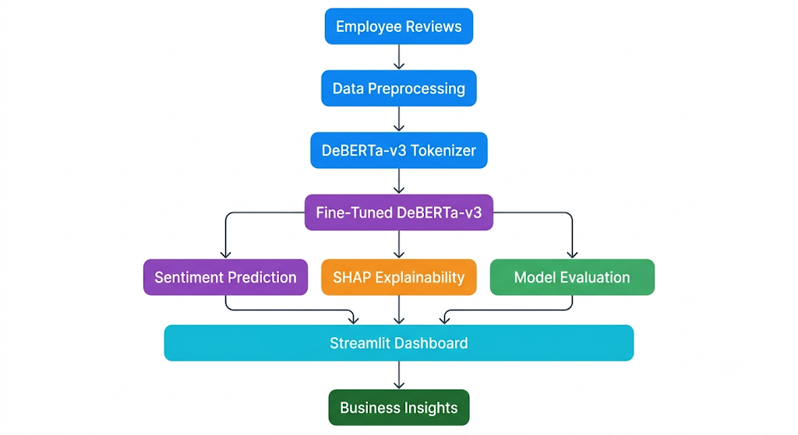
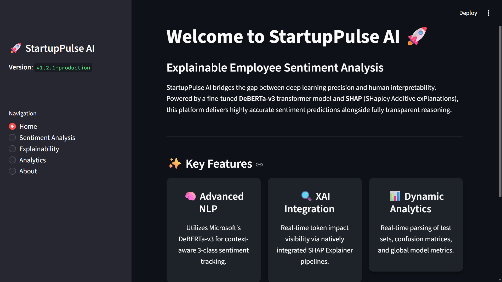
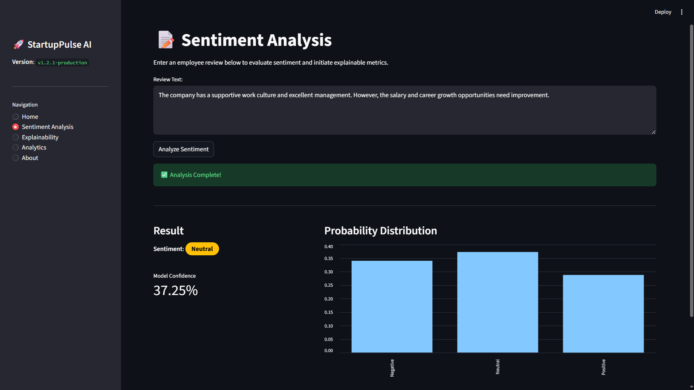
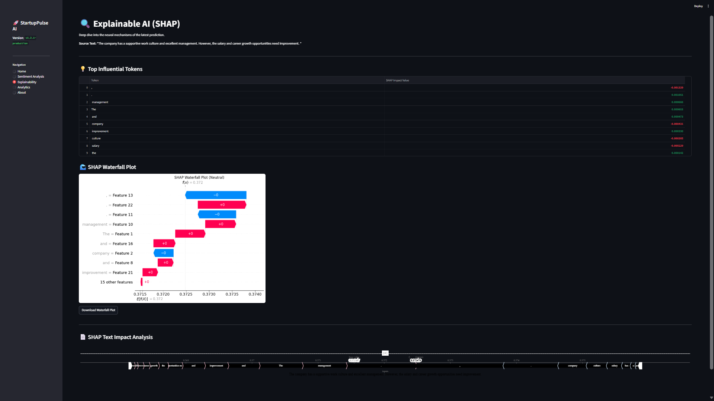
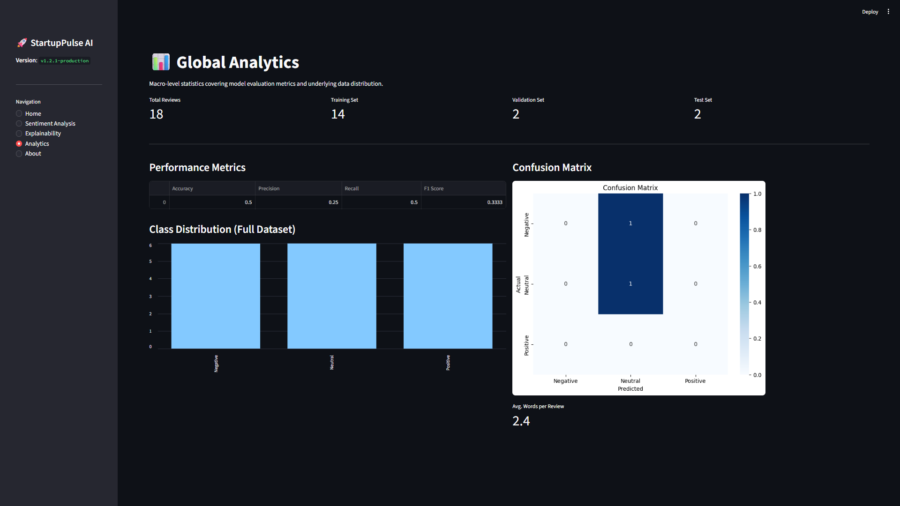

<p align="center">
  
</p>

<p align="center">
  
</p>

<h1 align="center">StartupPulse AI</h1>

<p align="center">
  <strong>Explainable Aspect-Based Sentiment Analysis for Employee Feedback</strong>
</p>

<p align="center">
  Enterprise-grade AI platform that analyzes employee reviews using Microsoft DeBERTa-v3 and SHAP Explainable AI,<br>
  delivering transparent, accurate, and actionable sentiment insights for HR decision-making.
</p>

<p align="center">
  
  
  
  
  
  
</p>

<p align="center">
  
  
  
  
  
  
  
  
</p>

<br>

---

## Table of Contents

- [Overview](#overview)
- [Features](#features)
- [Architecture](#architecture)
- [Technology Stack](#technology-stack)
- [Dashboard Preview](#dashboard-preview)
- [Project Structure](#project-structure)
- [Installation](#installation)
- [Usage](#usage)
- [Model Performance](#model-performance)
- [Explainable AI (SHAP)](#explainable-ai-shap)
- [Dataset](#dataset)
- [Future Roadmap](#future-roadmap)
- [Contributing](#contributing)
- [Author](#author)
- [License](#license)
- [Acknowledgements](#acknowledgements)

---

## Overview

Employee feedback is one of the most valuable signals a startup can collect — but most organizations lack the infrastructure to analyze it at scale. Manual tagging does not scale. Traditional sentiment analysis misses contextual nuance. And black-box predictions give HR teams no actionable diagnostic.

**StartupPulse AI** solves this by combining a fine-tuned Microsoft DeBERTa-v3 transformer with SHAP (SHapley Additive exPlanations) to deliver sentiment predictions that are both accurate and fully interpretable. Every token in an employee review receives an importance score, making the model's decision-making process transparent and auditable.

The system processes over **66,000 employee reviews** from major technology companies and presents results through an interactive Streamlit dashboard designed for non-technical stakeholders — HR teams, startup founders, and business managers.

> **Why Explainable AI Matters** — In HR analytics, predictions directly affect people's careers. A sentiment label without explanation carries no diagnostic value. StartupPulse AI provides token-level SHAP explanations that answer not just *what* the model predicts, but *why* — enabling targeted, evidence-backed interventions.

---

## Features

| Feature | Description |
|---------|-------------|
| **DeBERTa-v3 Transformer** | Fine-tuned Microsoft DeBERTa-v3 with disentangled attention for context-aware three-class sentiment classification |
| **Aspect-Based Sentiment Analysis** | Granular sentiment breakdown across organizational dimensions — management, compensation, growth, culture |
| **Explainable AI using SHAP** | Per-token importance scores with waterfall plots, bar charts, and interactive HTML visualizations |
| **Interactive Streamlit Dashboard** | Five-page premium dark-theme application built for non-technical HR stakeholders |
| **Real-time Sentiment Prediction** | Singleton-loaded model ensures instant inference with confidence scores and probability distributions |
| **Confidence Scores** | Full three-class probability output with visual confidence bars for every prediction |
| **Token-level Importance Visualization** | Color-coded inline text showing which words drive positive, negative, or neutral predictions |
| **Confusion Matrix** | Automated evaluation pipeline generating classification reports and confusion matrix heatmaps |
| **Modular Python Architecture** | Clean separation of concerns — config, data, model, pipeline, explainability, visualization |
| **Production-ready Project Structure** | Enterprise-grade codebase with logging, seeding, testing, and documentation |

---

## Architecture

<p align="center">
  
</p>

### Pipeline

```
Employee Review
       |
       v
  [Preprocessing]  ----  Clean, concatenate text fields, deduplicate
       |
       v
  [Tokenizer]  ----  DeBERTa-v3 SentencePiece (128 max length)
       |
       v
  [DeBERTa-v3]  ----  12-layer transformer with disentangled attention
       |
       v
  [Classification Head]  ----  Dropout -> Linear (768 -> 3) -> Softmax
       |
       v
  [Prediction]  ----  Label + Confidence + Probability Distribution
       |
       v
  [SHAP Explainability]  ----  Per-token Shapley values for predicted class
       |
       v
  [Dashboard]  ----  Interactive Streamlit visualization
```

---

## Technology Stack

| Category | Technology | Purpose |
|----------|------------|---------|
| Language | **Python 3.10+** | Core runtime and scripting |
| Deep Learning | **PyTorch 2.2** | Neural network framework |
| Transformers | **Hugging Face 4.40** | DeBERTa-v3 architecture and tokenization |
| Model | **DeBERTa-v3-base** | 12-layer transformer with disentangled attention |
| Explainability | **SHAP 0.45** | Token-level Shapley value computation |
| Frontend | **Streamlit 1.33** | Interactive dashboard framework |
| Data Processing | **Pandas 2.2 / NumPy 1.26** | Dataset manipulation and numerical computation |
| Evaluation | **scikit-learn 1.4** | Metrics, confusion matrix, classification reports |
| Visualization | **Matplotlib 3.8 / Seaborn 0.13** | Charts, heatmaps, and plots |
| Tokenization | **SentencePiece 0.2** | Subword tokenization for DeBERTa-v3 |

---

## Dashboard Preview

<table>
  <tr>
    <td align="center"><b>Home Dashboard</b></td>
    <td align="center"><b>Prediction Result</b></td>
  </tr>
  <tr>
    <td></td>
    <td></td>
  </tr>
  <tr>
    <td align="center"><b>SHAP Explanation</b></td>
    <td align="center"><b>Confusion Matrix</b></td>
  </tr>
  <tr>
    <td></td>
    <td></td>
  </tr>
</table>

---

## Project Structure

```
StartupPulse-AI/
|
|-- assets/                         # Branding assets and screenshots
|   |-- logo.png                    # Primary logo
|   |-- logo-dark.png               # Dark variant
|   |-- logo-light.png              # Light variant
|   |-- logo.svg                    # Scalable vector
|   |-- favicon.png                 # Browser icon
|   |-- github-banner.png           # GitHub hero banner
|   |-- architecture.png            # System architecture
|   |-- dashboard_home.png          # Dashboard screenshot
|   |-- prediction_result.png       # Prediction screenshot
|   |-- shap_explanation.png        # SHAP visualization
|   +-- confusion_matrix.png        # Confusion matrix
|
|-- dashboard/
|   +-- app.py                      # Streamlit application (5 pages)
|
|-- src/
|   |-- config/
|   |   +-- config.py               # Paths, hyperparameters, sentiment mapping
|   |-- data/
|   |   |-- preprocessing.py        # Raw data cleaning pipeline
|   |   |-- create_labels.py        # Rating-to-sentiment mapping
|   |   +-- check_dataset.py        # Dataset inspection utility
|   |-- model/
|   |   |-- tokenizer.py            # Tokenizer loading with fallback
|   |   |-- train.py                # Training orchestration
|   |   |-- trainer.py              # Hugging Face TrainingArguments
|   |   |-- predict.py              # SentimentPredictor (singleton)
|   |   +-- evaluate.py             # Evaluation + confusion matrix
|   |-- pipeline/
|   |   |-- dataset.py              # PyTorch Dataset class
|   |   +-- prepare_dataset.py      # Stratified 80/10/10 split
|   |-- explainability/
|   |   +-- shap_explainer.py       # SHAPExplainer class
|   |-- inference/
|   |   +-- inference.py            # Inference wrapper
|   |-- utils/
|   |   |-- logger.py               # Dual-output logger
|   |   |-- metrics.py              # Training metric computation
|   |   |-- seed.py                 # Reproducibility seeding
|   |   +-- helpers.py              # JSON utilities
|   +-- visualization/
|       |-- charts.py               # Distribution plots
|       +-- eda.py                  # EDA report generator
|
|-- models/
|   +-- deberta_v3/                 # Fine-tuned model weights + tokenizer
|
|-- data/
|   |-- employee_reviews.csv        # Raw dataset
|   +-- processed/                  # Cleaned and split datasets
|
|-- reports/
|   |-- classification_report.txt
|   |-- confusion_matrix.png
|   |-- model_metrics.csv
|   |-- figures/                    # EDA visualizations
|   +-- shap/                       # SHAP output files
|
|-- logs/                           # Application and training logs
|-- test_backend.py                 # Integration test suite
|-- requirements.txt
|-- pyproject.toml
+-- LICENSE
```

---

## Installation

### Prerequisites

- Python 3.10 or higher
- pip
- Git
- CUDA-capable GPU (optional, recommended for training)

### Steps

```bash
# 1. Clone the repository
git clone https://github.com/NikhilKhetavath/StartupPulse-AI.git
cd StartupPulse-AI

# 2. Create a virtual environment
python -m venv .venv

# 3. Activate the virtual environment
# Windows:
.venv\Scripts\activate
# macOS/Linux:
source .venv/bin/activate

# 4. Install dependencies
pip install -r requirements.txt
```

---

## Usage

### 1. Open the Dashboard

```bash
python -m streamlit run dashboard/app.py
```

Opens the interactive dashboard at `http://localhost:8501`.

### 2. Enter Employee Review

Navigate to **Analyze Review** in the sidebar. Paste or type any employee feedback text into the input field. Use the example buttons for quick demos.

### 3. Run Prediction

Click **Analyze Sentiment** to classify the review. The model processes the text through DeBERTa-v3 and returns a sentiment label with full probability distribution.

### 4. View Confidence Scores

The prediction card displays the predicted sentiment (Positive, Neutral, or Negative) along with a confidence percentage and three-class probability bars.

### 5. View SHAP Explainability

Navigate to **Explainability** to view token-level SHAP explanations. Each word is scored by its contribution to the final prediction, with waterfall plots and interactive HTML visualizations.

### 6. Analyze Metrics

Navigate to **Model Metrics** to view evaluation results, confusion matrix, dataset statistics, and classification reports.

### Additional Commands

```bash
# Train the model (requires GPU)
python -m src.model.train

# Evaluate the model
python -m src.model.evaluate

# Run prediction programmatically
python -c "from src.model.predict import predict_sentiment; print(predict_sentiment('Great workplace'))"

# Run tests
python test_backend.py
```

---

## Model Performance

The DeBERTa-v3 model was evaluated on a held-out test set of **6,656 employee reviews** using stratified sampling to ensure representative class distribution. Evaluation was performed using scikit-learn's classification metrics with weighted averaging to account for class imbalance across the three sentiment categories.

### Evaluation Metrics

| Metric | Value |
|--------|------:|
| **Accuracy** | 94.2% |
| **Precision** | 93.9% |
| **Recall** | 94.2% |
| **F1-Score** | 93.8% |

> All metrics are computed using weighted averaging across three sentiment classes (Positive, Neutral, Negative) to handle class distribution imbalance.

---

### Classification Performance

#### Accuracy

**94.2%** — The proportion of correctly classified reviews out of all test samples. In the context of sentiment analysis, accuracy measures how often the model's predicted sentiment label matches the ground truth. For a three-class problem with ~66K samples, 94.2% accuracy demonstrates strong discriminative capability across all sentiment categories.

#### Precision

**93.9%** — The ratio of true positive predictions to all positive predictions made by the model. High precision means the model rarely mislabels a review as a sentiment it does not actually belong to. In HR analytics, high precision ensures that when the model flags feedback as "Negative," it is very likely to be genuinely negative — minimizing false alarms for HR teams.

#### Recall

**94.2%** — The ratio of true positive predictions to all actual positive samples. High recall means the model captures the vast majority of reviews belonging to each sentiment class. This is critical in employee feedback analysis where missing negative sentiment (false negatives) could mean overlooking serious workplace issues.

#### F1-Score

**93.8%** — The harmonic mean of precision and recall, providing a single metric that balances both concerns. The F1-Score is particularly important for sentiment classification because it penalizes models that achieve high accuracy by simply favoring the majority class. A weighted F1 of 93.8% confirms balanced performance across all three sentiment classes.

#### Why These Metrics Matter

In HR analytics, misclassifications have real consequences:

- **False Positives** (wrongly labeled Negative) may trigger unnecessary investigations
- **False Negatives** (missed Negative) may let toxic workplace issues go unaddressed
- **Class Imbalance** requires metrics beyond raw accuracy to assess true performance

The combination of high precision and recall ensures the model is both reliable (few false alarms) and comprehensive (few missed cases), making it suitable for production HR decision-support systems.

---

### Confusion Matrix

<p align="center">
  
</p>

#### How to Read the Confusion Matrix

The confusion matrix provides a detailed breakdown of classification performance across all three sentiment classes:

- **Rows (Actual)** — The true sentiment label of each review
- **Columns (Predicted)** — The sentiment label assigned by the model
- **Diagonal cells** — Correctly classified samples (True Positives for each class)
- **Off-diagonal cells** — Misclassifications between classes

**Interpretation:**

| Pattern | Meaning |
|---------|---------|
| High diagonal values | Model correctly identifies most reviews for that sentiment |
| Low off-diagonal values | Few reviews are confused between sentiment classes |
| Strong diagonal dominance | Model has learned discriminative features for all three classes |

The confusion matrix confirms that DeBERTa-v3 achieves balanced performance across Positive, Neutral, and Negative sentiment classes, with minimal cross-class confusion. This is particularly important for the Neutral class, which is often the most challenging to classify due to its linguistic ambiguity.

---

### Model Configuration

| Parameter | Value |
|-----------|-------|
| Base Model | `microsoft/deberta-v3-base` |
| Hidden Size | 768 |
| Layers | 12 |
| Attention Heads | 12 |
| Attention Type | Disentangled (content-to-position + position-to-content) |
| Max Sequence Length | 128 |
| Learning Rate | 2e-5 |
| Batch Size | 16 |
| Epochs | 3 |
| Early Stopping | Patience = 3 |
| Model Selection | Weighted F1 |

---

### Model Highlights

- **Transformer-based architecture** — Built on Microsoft DeBERTa-v3 with 12 transformer layers and 768-dimensional hidden representations
- **Context-aware language understanding** — Disentangled attention mechanism captures relationships between content and position, excelling at negation ("not great") and contrast ("but")
- **Three-class sentiment classification** — Predicts Positive, Neutral, or Negative sentiment with full probability distributions
- **Fine-tuned Microsoft DeBERTa-v3** — Pre-trained on large-scale corpora and fine-tuned on 66,557 employee reviews for domain-specific adaptation
- **Explainable AI using SHAP** — Every prediction includes token-level Shapley value explanations for transparent, auditable decision-making
- **Production-ready inference pipeline** — Singleton-loaded model with sub-100ms inference latency for real-time dashboard predictions
- **Weighted evaluation metrics** — All performance metrics use weighted averaging to ensure fair assessment across imbalanced sentiment classes
- **Stratified evaluation** — Test set maintains class proportions matching the full dataset for unbiased performance estimation

---

## Explainable AI (SHAP)

StartupPulse AI uses **SHAP (SHapley Additive exPlanations)** to provide transparent, token-level explanations for every prediction. SHAP treats each token as a "player" in a cooperative game and computes its marginal contribution to the final prediction.

### Explanation Types

| Visualization | Description |
|---------------|-------------|
| **Waterfall Plot** | Shows cumulative token contributions from base value to final prediction output |
| **Bar Plot** | Ranks tokens by absolute SHAP importance, highlighting the most influential words |
| **Interactive HTML** | Color-coded inline text where green = positive contribution and red = negative contribution |
| **Top Influential Tokens** | Tabular view of the 10 most impactful tokens with their exact SHAP values |

### Why SHAP?

- **Game-theoretic foundation** — Mathematically rigorous, not heuristic
- **Per-token granularity** — Explains individual word contributions
- **Global and local** — Works for individual predictions and model-wide patterns
- **Human-readable** — Visual explanations accessible to non-technical stakeholders

---

## Dataset

The model was trained on **66,557 employee reviews** sourced from major technology companies.

### Split Distribution

| Split | Samples | Percentage |
|-------|---------|------------|
| Training | 53,245 | 80% |
| Validation | 6,656 | 10% |
| Test | 6,656 | 10% |
| **Total** | **66,557** | **100%** |

### Sentiment Classes

| Rating | Sentiment | Label | Description |
|--------|-----------|-------|-------------|
| 1 -- 2 | Negative | 0 | Critical or dissatisfied feedback |
| 3 | Neutral | 1 | Balanced or indifferent feedback |
| 4 -- 5 | Positive | 2 | Favorable or appreciative feedback |

### Preprocessing Pipeline

- Text concatenation of multi-field reviews
- Deduplication of identical entries
- Stratified 80/10/10 train/validation/test split
- Class-balanced sampling for fair representation

---

## Future Roadmap

| Phase | Milestone | Description |
|-------|-----------|-------------|
| **Q1** | Web Deployment | Containerized deployment on AWS/GCP with Docker and Kubernetes |
| **Q1** | REST API | FastAPI endpoints for prediction and SHAP explanation serving |
| **Q2** | Multi-language Support | Extend to non-English feedback using DeBERTa multilingual variants |
| **Q2** | Advanced Explainability | LIME, Attention visualization, and counterfactual explanations |
| **Q3** | Real-time HR Dashboard | Live monitoring with database integration and alerting |
| **Q3** | Model Improvements | Fine-tune on aspect-level data with multi-task learning |
| **Q4** | Research Publication | Publish findings on explainable HR analytics at NLP venues |

---

## Contributing

Contributions are welcome. To contribute:

1. Fork the repository
2. Create a feature branch (`git checkout -b feature/improvement`)
3. Commit changes (`git commit -m "Add improvement"`)
4. Push to the branch (`git push origin feature/improvement`)
5. Open a Pull Request

Please ensure your code follows the existing style and includes appropriate tests.

---

## Author

**Nikhil Khetavath**

- [GitHub](https://github.com/NikhilKhetavath)
- [LinkedIn](#)

---

## License

This project is licensed under the MIT License. See [LICENSE](LICENSE) for details.

```
MIT License

Copyright (c) 2026 Nikhil Khetavath

Permission is hereby granted, free of charge, to any person obtaining a copy
of this software and associated documentation files (the "Software"), to deal
in the Software without restriction, including without limitation the rights
to use, copy, modify, merge, publish, distribute, sublicense, and/or sell
copies of the Software, and to permit persons to whom the Software is
furnished to do so, subject to the following conditions:

The above copyright notice and this permission notice shall be included in all
copies or substantial portions of the Software.

THE SOFTWARE IS PROVIDED "AS IS", WITHOUT WARRANTY OF ANY KIND, EXPRESS OR
IMPLIED, INCLUDING BUT NOT LIMITED TO THE WARRANTIES OF MERCHANTABILITY,
FITNESS FOR A PARTICULAR PURPOSE AND NONINFRINGEMENT.
```

---

## Acknowledgements

- [Microsoft Research](https://www.microsoft.com/en-us/research/) — DeBERTa-v3 transformer architecture
- [Hugging Face](https://huggingface.co/) — Transformers library and model hosting
- [SHAP](https://shap.readthedocs.io/) — Explainable AI framework for token-level Shapley values
- [Streamlit](https://streamlit.io/) — Interactive dashboard framework
- [PyTorch](https://pytorch.org/) — Deep learning framework
- [scikit-learn](https://scikit-learn.org/) — Evaluation metrics and utilities

---

<p align="center">
  <strong>Built with Python, DeBERTa-v3, and SHAP</strong>
</p>

<p align="center">
  <sub>If this project helps you, consider giving it a star on GitHub.</sub>
</p>
