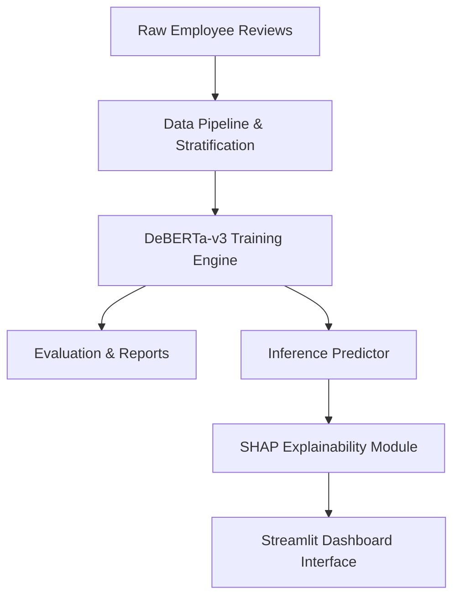

# StartupPulse AI 🚀


**Explainable Employee Sentiment Analysis using DeBERTa-v3 and SHAP.**

StartupPulse AI is a production-ready, research-grade platform designed to bring transparency and deep learning precision to Human Resources and organizational psychology metrics. It transitions the classic "black-box" NLP sentiment classifier into a trusted, fully interpretable analytical tool.

---

## 🎯 Features

- **State-of-the-Art NLP**: Utilizes Microsoft's `DeBERTa-v3-base` fine-tuned for high-accuracy 3-class sentiment tracking.
- **Explainable AI (XAI)**: Natively integrates SHAP (SHapley Additive exPlanations) to dynamically map specific textual tokens to their neural prediction impact.
- **Dynamic Analytics**: Automated macro-level statistics parsing evaluation matrices, classification reports, and dataset distributions.
- **Professional Dashboard**: A beautifully designed, highly responsive Streamlit web application.
- **Production Ready**: Robust exception handling, unified logging, and `pathlib` OS-agnostic structural integrity.

---

## 🏗️ Architecture



---

## 📂 Folder Structure

```text
StartupPulse-AI/
├── dashboard/       # Professional Streamlit web application
├── data/            # Stratified employee review datasets
├── models/          # Trained DeBERTa-v3 weights & tokenizers
├── reports/         # Confusion matrices, classification logs, and SHAP visual outputs
├── src/             
│   ├── config/      # OS-agnostic pathlib configurations
│   ├── explainability/ # SHAP tensor extraction and plotting mechanics
│   ├── inference/   # REST/API ready inference endpoints
│   ├── model/       # Transformers v5 Training, Evaluation, and Prediction logic
│   ├── pipeline/    # PyTorch dataset handlers
│   └── utils/       # Centralized metrics, seeders, and application loggers
├── test_backend.py  # CI/CD ready structural backend validation suite
├── requirements.txt # Pinned project dependencies
└── README.md        # Project documentation
```

---

## 🚀 Installation & Usage

### 1. Installation
Clone the repository and install the precisely pinned dependencies:
```bash
git clone https://github.com/yourusername/StartupPulse-AI.git
cd StartupPulse-AI
python -m venv .venv
source .venv/bin/activate  # Windows: .venv\Scripts\activate
pip install -r requirements.txt
```

### 2. Launching the Dashboard
Launch the frontend UI to interact with the model:
```bash
streamlit run dashboard/app.py
```

### 3. Model Training
To retrain the model on new data:
```bash
python -m src.model.train
```

### 4. Model Evaluation
To evaluate precision, recall, f1, and generate a confusion matrix:
```bash
python -m src.model.evaluate
```

---

## 📊 SHAP Explainability

StartupPulse AI uses the `shap.Explainer` library targeted at HuggingFace tokenizers to trace neural activation directly back to character tokens. The dashboard generates:
1. **Waterfall Plots**: Tracking exactly how base values shift toward the final probability.
2. **Token Importance Matrices**: Highlighting semantic drivers of positive/negative sentiment.

---

## 📈 Future Work
- **Containerization**: Wrapping the inference endpoint and dashboard in Docker containers for AWS/GCP deployments.
- **Active Learning**: Integrating feedback mechanisms in the dashboard to flag misclassifications for continuous re-training.
- **Topic Modeling**: Clustering distinct corporate complaints (e.g., "compensation" vs "management").

---

## ⚖️ License
This project is licensed under the MIT License - see the LICENSE file for details.
