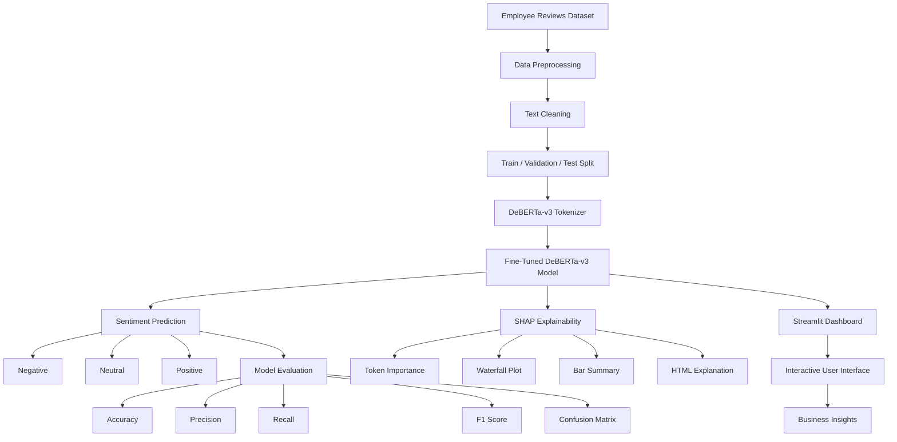

# StartupPulse AI - System Architecture

```mermaid
flowchart TD

A[Employee Reviews Dataset]
--> B[Data Preprocessing]

B --> C[Text Cleaning]
C --> D[Train / Validation / Test Split]

D --> E[DeBERTa-v3 Tokenizer]

E --> F[Fine-Tuned DeBERTa-v3 Model]

F --> G[Sentiment Prediction]

G --> H[Negative]
G --> I[Neutral]
G --> J[Positive]

F --> K[SHAP Explainability]

K --> L[Token Importance]
K --> M[Waterfall Plot]
K --> N[Bar Summary]
K --> O[HTML Explanation]

G --> P[Model Evaluation]

P --> Q[Accuracy]
P --> R[Precision]
P --> S[Recall]
P --> T[F1 Score]
P --> U[Confusion Matrix]

F --> V[Streamlit Dashboard]

V --> W[Interactive User Interface]
W --> X[Business Insights]
```